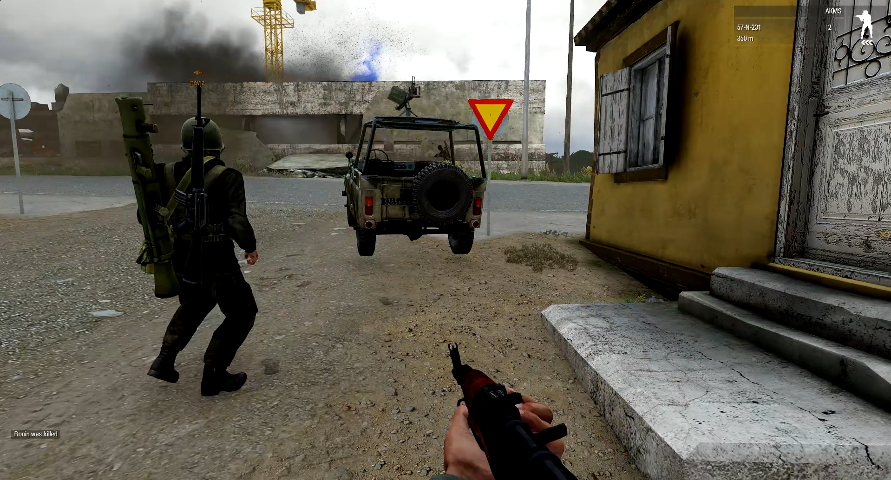

<link rel="stylesheet" href="assets/css/style.css">

# 🪖 DIVIZION M.A.D.
**Milsim without the roleplay.**  
_A realistic level milsim group that ditches the unecessary hassles and roleplay-aspects, to be more beginner friendly. _

---

## Mission Statement
DIVIZION M.A.D. brings elite realism to Arma 3, through tightly-coordinated teamplay, immersive operations, and a brotherhood forged in virtual fire.

---

## Structure & Roles
- Commander and Squad Leaders: Used to coordinate, plan and execute operations
- Using Task Force Arrowhead Radio (TFAR) to communicate

---

## 🎥 Media

▶️ [Watch our latest op](https://youtube.com)

---

## 📝 Enlist Now
Think you’ve got what it takes?  
👉 [Join us on Discord!](https://discord.gg/tZ5FnVWxxM)

---

## Contact
👉 [Discord](https://discord.gg/tZ5FnVWxxM)
👉 [Twitter/X](https://x.com/DivizionMAD)
👉 [Tiktok](https://www.tiktok.com/@sejosboys)
👉 [Youtube](https://www.youtube.com/@DivizionM.A.D)
👉 [Arma 3 Unit](https://units.arma3.com/unit/dmad)
👉 [Steam Group](https://steamcommunity.com/groups/divizionmad)

- 

---

_© 2025 DIVIZION M.A.D. – All rights reserved_
